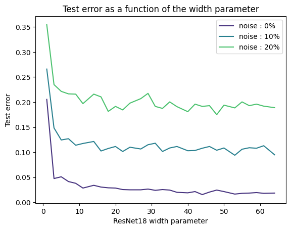
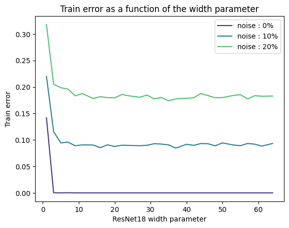
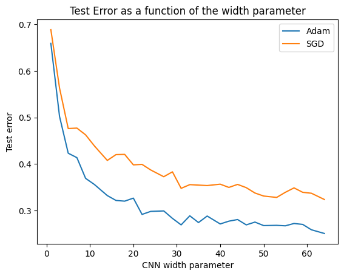
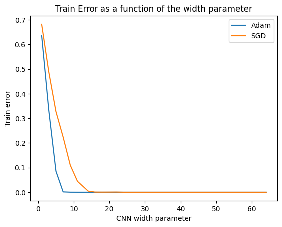

<div align="center">

</div>

<div align="center">
Ecole Polytechnique Fédérale de Lausanne
</div> 
<div align="center">
EE-411: Fundamentals of Inference and Learning
</div> 

# Deep Double Descent: When Bigger Models and More Data Hurt

## Table of Contents

- [Abstract](#abstract)
- [Project Structure](#project-structure)
- [Conda Environment](#conda-environment)
- [Contributors](#contributors)
- [Results](#results)

## Abstract 

Modern machine learning research shows that the classical bias-variance trade-off has its limitations as model size increases. Contrary to the classical machine learning perspective, increasing the complexity of a model does not always lead to overfitting. The purpose of this project is to replicate a research study conducted by engineers from Harvard and OpenAI [(Link to Publication)](https://arxiv.org/abs/1912.02292). This paper unites both sides (classical and modern) by showcasing that there is no contradiction between the two points of view."

## Project structure
```
.
├── LICENSE
├── README.md
├── data
│   ├── datasets
│   └── pickle
├── requirements.yml
├── ressources
│   ├── ee411_foil_project1.pdf
│   ├── ee411_foil_projects_description.pdf
│   ├── logo-epfl.png
│   └── report
├── source
│   ├── constants.py
│   ├── data_classes.py
│   ├── data_utils.py
│   ├── display_functions.py
│   ├── functions.py
│   ├── main.ipynb
│   ├── models
│   └── training_utils.py
└── template
    ├── custom_colormaps
    ├── intro_ocean_dynamics.ipynb
    ├── intro_ocean_plot.ipynb
    └── intro_resnet_plot.ipynb
```

The project is segmented into three primary sections. The initial phase involves a preprocessing task where various datasets are presented. Different transformations, such as horizontal flips or random crops, are set. Subsequently, the second part comprises conducting experiments to justify the selection of parameters and models for the subsequent phase. In the final part, an attempt is made to replicate figures 4 and 6 from the specified paper.

## Conda environment
A conda environment, named projectFOIL, with all Python packages that you might need for running the project is provided. You can install it with the following command : 

`conda env create -f requirements.yml`

Once installed, to activate the environment, please use `conda activate FOILproject`. 


## Contributors
This project has been done by Vincent Roduit and Fabio Palmisano as a mandatory part of the course "EE-411: Fundamentals of Inference and Learning" given at Ecole Polytechnique Fédérale de Lausanne during the Fall semester of 2023.

## Results
Figure 4 and 6 of the original paper has been reproduced. The derivation of the results can be found in file *source/main.ipynb*. For theoretical aspects and justifications, please reffer to the report (*ressources/ee411_project_report*)

### Figure 4

</div>

</div>

### Figure 6

</div>

</div>

